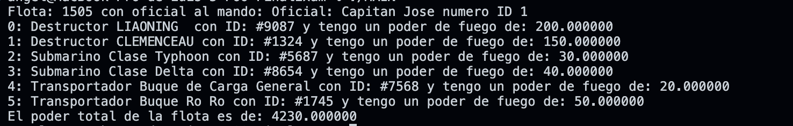

#   POO Final Exam 

## Description
This programs were developed for the final examen of the subject "Object Oriented Programming" were the main objective was to demostrate the knowledge of how to implement the main topics about POO. 

## Main Learnings 
* Class definition and implementation
* UML understanding and development
* Inheritance
* Polymorphism
* Header Files
* Pointers
* Virtual Functions

## Installation
* Make sure to have installed a C++ enviroment 
* Download the repository on your local machine
* Run the command <code>./main</code> on the terminal located at the root path of the project

## Screenshots
 
